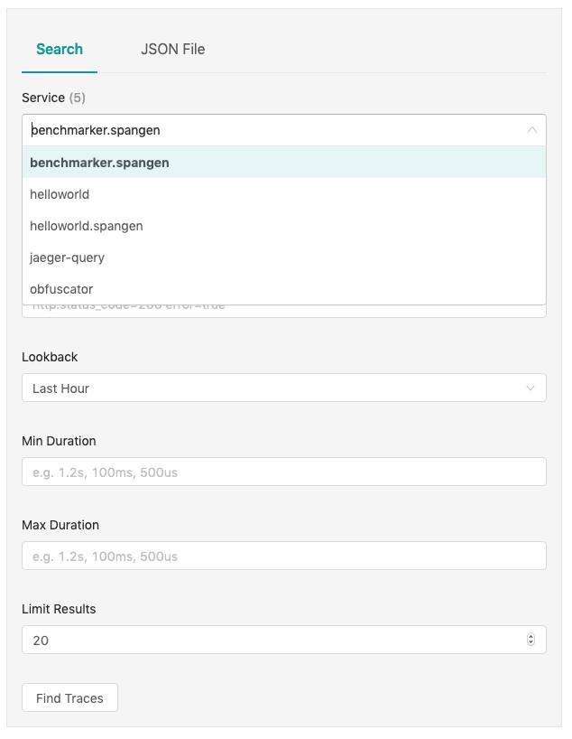
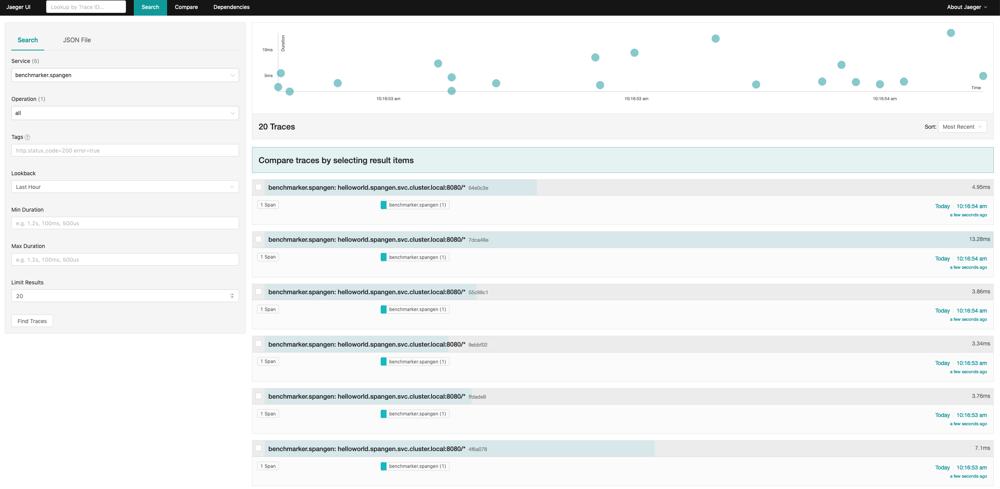
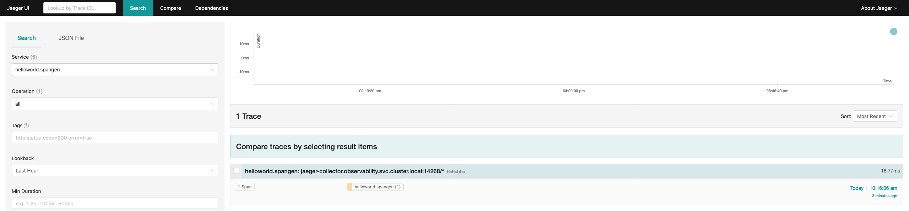
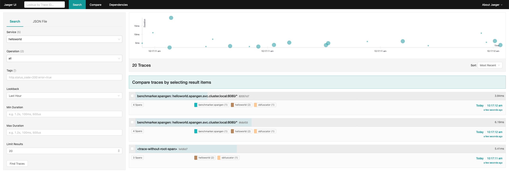
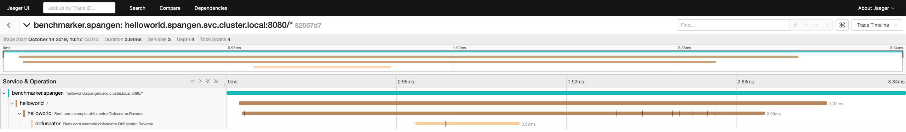

# Spangen

Demonstration project to show that spans are disconnected when bridging Jetty HTTP -> gRPC in istio. 

## Steps to Reproduce

To reproduce this issue we need to boot the project minikube. You may do that by running the following:

```
./k8s/bootstrap.sh
```

This will create a new minikube on your system called `spangen`. You will need to have minikube set up for your environment
already. See instructions [here](https://kubernetes.io/docs/tasks/tools/install-minikube/) if you have not got minikube
installed. 

Once you have `spangen` minikube booted you will see three services deployed in the `spangen` namespace:

 * `obfuscator` : a gRPC service that reverses whatever you send it
 * `helloworld` : an HTTP service that sends 'hello, world' to `obfuscator` and then wraps the result up in json
 * `benchmarker` : a service to generate load against `helloworld`
 
All but the last service are sending traces directly to the jaeger collector running in `observability` namespace and,
being that they're embedded in an istio mesh, the mesh is sending traces to the collector as well. You can confirm 
that `helloworld` is working as expected by doing the following:

First, forward the `helloworld` external port to your localhost:

```
> kubectl -nspangen port-forward svc/helloworld 8080:8080
Forwarding from 127.0.0.1:8080 -> 8080
Forwarding from [::1]:8080 -> 8080
Handling connection for 8080
```

and from your local machine:

```
> curl localhost:8080
{"characters":["d","l","r","o","w"," ",",","o","l","l","e","h"]}
```

Now, let's take a look at the system traces. Forward jaeger query to your localhost:

```
> kubectl -nobservability port-forward svc/jaeger-query 16686:16686
Forwarding from 127.0.0.1:16686 -> 16686
Forwarding from [::1]:16686 -> 16686
```

Now visit at http://localhost:16686. What you _should_ see are traces connected from `helloworld -> obfuscator` 
with some mesh in between but this is not happening. When I examine the UI I see mesh trashes that begin at `benchmarker`
but don't dip all the way down to `obfuscator`. 

Here's the service list I see: 

Your list may vary a little depending on sampling since the minikube jaeger is only in-memory. I believe that anything 
with the namespace in the service name is an istio originated trace. Clicking through to those finds no connection, 
like so:  and: 

The non-istio traces appear to be connected:  and 

